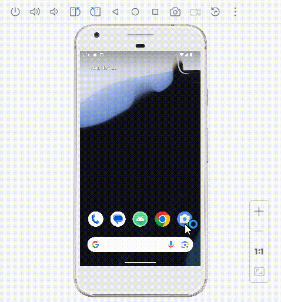

# Android Studio 中的照片讀取應用程式

這個 Android Studio 專案，這是一個基本的應用程式，旨在讓使用者能夠從手機中選擇並讀取照片。未來的計劃包括整合 OpenCV 套件，以增強應用程式的圖像處理功能。

## 簡介

這個應用程式的初衷是提供一個簡單的界面，允許使用者從手機相冊中選擇照片，並顯示在應用程式中。目前，應用程式的主要功能是使用 Android 內建的圖片選擇器，並在選擇照片後將其顯示在應用程式的介面上。

未來的版本將引入 OpenCV 套件，以開發更強大的圖像處理功能。

# Android 應用程式 UI 介面

這個 Android 應用程式的 UI 介面由一個 `RelativeLayout` 組成，包含了以下元素：

## 按鈕（Button）

```xml
<Button
    android:id="@+id/btnOpenGallery"
    android:layout_width="wrap_content"
    android:layout_height="wrap_content"
    android:text="打開圖片選擇器"
    android:layout_centerHorizontal="true"
    android:layout_marginTop="16dp" />
```

這個按鈕的屬性設定如下：
- **ID：** `btnOpenGallery`
- **寬度和高度：** `wrap_content`
- **文字內容：** "打開圖片選擇器"
- **水平居中對齊：** `android:layout_centerHorizontal="true"`
- **距離上方的邊距：** `android:layout_marginTop="16dp"`

## 圖片顯示區域（ImageView）

```xml
<ImageView
    android:id="@+id/imageView"
    android:layout_width="match_parent"
    android:layout_height="wrap_content"
    android:layout_below="@id/btnOpenGallery"
    android:layout_centerHorizontal="true"
    android:layout_marginTop="16dp"
    android:src="@drawable/ic_launcher_foreground"
    android:scaleType="centerInside" />
```

這個 `ImageView` 的屬性設定如下：
- **ID：** `imageView`
- **寬度：** `match_parent`
- **高度：** `wrap_content`
- **相對於按鈕的下方顯示：** `android:layout_below="@id/btnOpenGallery"`
- **水平居中對齊：** `android:layout_centerHorizontal="true"`
- **距離上方的邊距：** `android:layout_marginTop="16dp"`
- **圖片資源：** `@drawable/ic_launcher_foreground`
- **圖片縮放類型：** `centerInside`

這個 UI 介面主要包含一個按鈕，用於打開圖片選擇器，以及一個 `ImageView`，用於顯示選擇的圖片。


## MainActivity.java
```
package com.example.readphotos; // 這是你應用程序的包名，請根據實際情況進行修改

import android.content.Intent;
import android.net.Uri;
import android.os.Bundle;
import android.provider.MediaStore;
import android.view.View;
import android.widget.Button;
import android.widget.ImageView;
import androidx.annotation.Nullable;
import androidx.appcompat.app.AppCompatActivity;

public class MainActivity extends AppCompatActivity {

    // 宣告常數，用於識別打開圖片選擇器的請求
    private static final int REQUEST_IMAGE_PICK = 2;

    // 宣告 UI 元素
    private Button btnOpenGallery;
    private ImageView imageView;

    @Override
    protected void onCreate(Bundle savedInstanceState) {
        super.onCreate(savedInstanceState);
        
        // 設定應用程式的主介面，這裡使用了 activity_main.xml 佈局文件
        setContentView(R.layout.activity_main);

        // 連結 UI 元素
        btnOpenGallery = findViewById(R.id.btnOpenGallery);
        imageView = findViewById(R.id.imageView);

        // 設定按鈕的點擊監聽器
        btnOpenGallery.setOnClickListener(new View.OnClickListener() {
            @Override
            public void onClick(View v) {
                openGallery();
            }
        });
    }

    // 打開圖片選擇器的函數
    private void openGallery() {
        // 創建一個 Intent，用於選擇圖片
        Intent pickPhoto = new Intent(Intent.ACTION_PICK,
                android.provider.MediaStore.Images.Media.EXTERNAL_CONTENT_URI);
        
        // 啟動圖片選擇器，並設定請求碼
        startActivityForResult(pickPhoto, REQUEST_IMAGE_PICK);
    }

    // 接收圖片選擇器的結果
    @Override
    protected void onActivityResult(int requestCode, int resultCode, @Nullable Intent data) {
        super.onActivityResult(requestCode, resultCode, data);

        // 確認結果是否成功
        if (resultCode == RESULT_OK) {
            // 確認請求碼是否為打開圖片選擇器的請求
            if (requestCode == REQUEST_IMAGE_PICK) {
                // 處理圖片選擇器的結果
                handleGalleryResult(data);
            }
        }
    }

    // 處理圖片選擇器的結果
    private void handleGalleryResult(Intent data) {
        if (data != null) {
            // 獲取選擇的圖片的 URI
            Uri selectedImage = data.getData();
            
            // 將選擇的圖片設定到 ImageView 中顯示
            imageView.setImageURI(selectedImage);
        }
    }
}
```

# MainActivity.java

## 主要部分

### 常數宣告
```java
// 用於識別打開圖片選擇器的請求
private static final int REQUEST_IMAGE_PICK = 2;
```

### UI 元素宣告
```java
// 打開圖片選擇器的按鈕和顯示選擇的圖片的元素
private Button btnOpenGallery;
private ImageView imageView;
```

### onCreate 方法
```java
// 在活動創建時執行，設定主介面、連結 UI 元素，並設定按鈕的點擊監聽器
@Override
protected void onCreate(Bundle savedInstanceState) {
    super.onCreate(savedInstanceState);

    // 設定主介面
    setContentView(R.layout.activity_main);

    // 連結 UI 元素
    btnOpenGallery = findViewById(R.id.btnOpenGallery);
    imageView = findViewById(R.id.imageView);

    // 設定按鈕的點擊監聽器
    btnOpenGallery.setOnClickListener(new View.OnClickListener() {
        @Override
        public void onClick(View v) {
            openGallery();
        }
    });
}
```

### openGallery 方法
```java
// 打開圖片選擇器的函數
private void openGallery() {
    // 創建一個 Intent，用於選擇圖片
    Intent pickPhoto = new Intent(Intent.ACTION_PICK,
            android.provider.MediaStore.Images.Media.EXTERNAL_CONTENT_URI);

    // 啟動圖片選擇器，並設定請求碼
    startActivityForResult(pickPhoto, REQUEST_IMAGE_PICK);
}
```

### onActivityResult 方法
```java
// 接收圖片選擇器的結果
@Override
protected void onActivityResult(int requestCode, int resultCode, @Nullable Intent data) {
    super.onActivityResult(requestCode, resultCode, data);

    // 確認結果是否成功
    if (resultCode == RESULT_OK) {
        // 確認請求碼是否為打開圖片選擇器的請求
        if (requestCode == REQUEST_IMAGE_PICK) {
            // 處理圖片選擇器的結果
            handleGalleryResult(data);
        }
    }
}
```

### handleGalleryResult 方法
```java
// 處理圖片選擇器的結果
private void handleGalleryResult(Intent data) {
    if (data != null) {
        // 獲取選擇的圖片的 URI
        Uri selectedImage = data.getData();

        // 將選擇的圖片設定到 ImageView 中顯示
        imageView.setImageURI(selectedImage);
    }
}
```

## 解釋

1. **"設定按鈕的點擊監聽器"**
   - 這段程式碼為 `btnOpenGallery` 按鈕設定了一個點擊事件監聽器，當按鈕被點擊時，執行 `openGallery()` 函數。

2. **打開圖片選擇器和處理選擇器結果的函數**
   - **`openGallery` 函數：**
     - 打開手機的圖片選擇器，讓使用者選擇一張圖片。
     - 創建 Intent 並啟動圖片選擇器。
   - **`onActivityResult` 函數：**
     - 接收其他 Activity 返回的結果，處理圖片選擇器的結果。
     - 根據請求碼進行相應處理。
   - **`handleGalleryResult` 函數：**
     - 處理圖片選擇器的結果，獲取選擇的圖片的 URI。
     - 將選擇的圖片設定到 ImageView 中顯示。

3. **處理打開圖片選擇器後的結果**
   - `onActivityResult` 方法在當

前活動收到其他 Activity 的返回結果時觸發。
   - 通過檢查結果是否成功且請求碼是否為打開圖片選擇器的請求，調用相應的處理方法。

4. **`handleGalleryResult` 方法**
   - 根據從圖片選擇器返回的 Intent 中的數據，獲取選擇的圖片的 URI。
   - 將該 URI 的圖片設定到應用程式中的 ImageView 中顯示。

## `AndroidManifest.xml` 的功能說明：

```xml
<?xml version="1.0" encoding="utf-8"?>
<manifest xmlns:android="http://schemas.android.com/apk/res/android"
    xmlns:tools="http://schemas.android.com/tools">

    <!-- 需要使用相機權限 -->
    <uses-permission android:name="android.permission.CAMERA" />
    <!-- 需要相機功能 -->
    <uses-feature android:name="android.hardware.camera" />
    <!-- 需要相機自動對焦功能 -->
    <uses-feature android:name="android.hardware.camera.autofocus" />
    <!-- 需要寫入外部存儲的權限 -->
    <uses-permission android:name="android.permission.WRITE_EXTERNAL_STORAGE" />
    <!-- 需要讀取外部存儲的權限 -->
    <uses-permission android:name="android.permission.READ_EXTERNAL_STORAGE" />

    <application
        android:allowBackup="true"
        android:dataExtractionRules="@xml/data_extraction_rules"
        android:fullBackupContent="@xml/backup_rules"
        android:icon="@mipmap/ic_launcher"
        android:label="@string/app_name"
        android:roundIcon="@mipmap/ic_launcher_round"
        android:supportsRtl="true"
        android:theme="@style/Theme.ReadPhotos"
        tools:targetApi="31">

        <!-- 定義應用程式的主活動 -->
        <activity
            android:name=".MainActivity"
            android:exported="true">
            <intent-filter>
                <action android:name="android.intent.action.MAIN" />
                <!-- 定義為主活動 -->
                <category android:name="android.intent.category.LAUNCHER" />
            </intent-filter>
        </activity>
    </application>

</manifest>
```

功能說明：
- `<uses-permission>` 標籤：指定應用程式需要的權限，例如使用相機、讀寫外部存儲等。
- `<uses-feature>` 標籤：指定應用程式需要的硬體功能，例如相機、相機自動對焦等。
- `<application>` 標籤：定義應用程式的主要配置，包括圖標、主題、支援的方向等。
- `<activity>` 標籤：定義應用程式的活動，這裡指定了 `MainActivity` 為主活動，並設定了相關的 `intent-filter`。

請注意，以上僅提供對清單檔中各個元素的基本功能說明。如果有特定的函數或功能需要進一步解釋，請提供相關的程式碼部分。




```python

```
